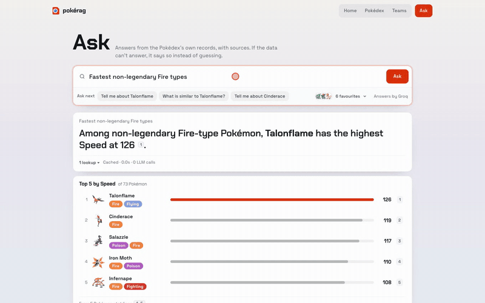

# pokérag

A Pokédex with an assistant that answers from real data. Browse all 1,025 Pokémon,
build and rate teams, run damage and catch-rate calculations, and ask questions in
plain English — every answer cites the records it came from, and says so when the data
can't answer.

Local and single-user. All Pokémon data is ingested from the
[PokéAPI](https://github.com/PokeAPI/pokeapi) CSV dataset into Postgres; nothing calls
PokéAPI at runtime. Everything works without an LLM key; a key adds narrated answers,
smarter planning, set suggestions and team summaries.

## Showcase

[](docs/media/pokerag-tour.mp4)

**[Watch the full two-minute tour (MP4)](docs/media/pokerag-tour.mp4)**: the home
dashboard (search, team coach, type calculator, Ask tile, lookup), the Pokédex catalog
and a detail page, Ask answering a ranking and a learnset question with citations, and
the team list and team page.

## What's in it

- **Home** — a dashboard: your teams at a glance, a type calculator, the Ask tile, a
  singles/doubles **damage calculator** with its own coach, a move/ability/item lookup,
  a nature helper and a catch-rate calculator. → [docs/product/home.md](docs/product/home.md)
- **Pokédex** — search, filter and sort every species; detail pages with stats,
  matchups, abilities, per-game movesets, evolutions, dex entries and where to catch
  it. → [docs/product/pokedex.md](docs/product/pokedex.md)
- **Ask** — questions about rankings, learnsets, moves, matchups, look-alikes, lore
  and more, answered from a retrieval plan with citations. → [docs/product/ask.md](docs/product/ask.md)
- **Teams** — build teams of six with legal sets, get graded, compare against another
  team, and ask a coach that can propose set changes and drafts (nothing saved until
  you apply). → [docs/product/teams.md](docs/product/teams.md)

## Quick start

```bash
cp .env.example .env
```

```bash
make up
```

```bash
make data
```

`make data` (first run only) migrates, ingests the CSVs, downloads sprites and builds
the search index; it runs on the host against the Compose database. Then open
http://localhost:3000. The API docs are at http://localhost:8000/docs.

To enable LLM features, set **one** of `ANTHROPIC_API_KEY` (preferred) or
`GROQ_API_KEY` (free tier) in `.env` and restart the backend. Ports, keys and dev
workflow: [docs/guides/local-dev.md](docs/guides/local-dev.md).

## Stack

| Layer | Technology |
|---|---|
| Frontend | Next.js 16 · React 19 · TypeScript · Tailwind CSS v4 · GSAP · Lenis |
| Backend | Python 3.12 · FastAPI · SQLAlchemy (async) · Alembic · Pydantic |
| Data | PostgreSQL 17 · pgvector · fastembed (local embeddings) |
| LLM | Anthropic Claude or Groq — optional |
| Tooling | uv · npm · Docker Compose · OpenSpec |

## How it works

Ask and both coaches run on one agent: each question becomes a plan of 1–6 typed tool
calls (picked by a free keyword planner, or one LLM call when needed), the tools read
the database, and the answer is written by code or by the LLM from those results only,
with `[n]` citations. Most retrieval is exact SQL; vector + full-text search covers lore
and look-alikes.

→ [docs/architecture/overview.md](docs/architecture/overview.md) ·
[ask-agent](docs/architecture/ask-agent.md) · [retrieval](docs/architecture/retrieval.md)

## Development

```bash
make test
```

```bash
make lint
```

```bash
make eval
```

`make eval` grades plans, retrieval and answers against a labelled set (spends LLM
tokens if a key is set; `--keyless` mode doesn't) — [docs/guides/eval.md](docs/guides/eval.md).

Contributors and coding agents: start with [CLAUDE.md](CLAUDE.md). All docs:
[docs/](docs/index.md). Feature work goes through OpenSpec (`openspec/`).
